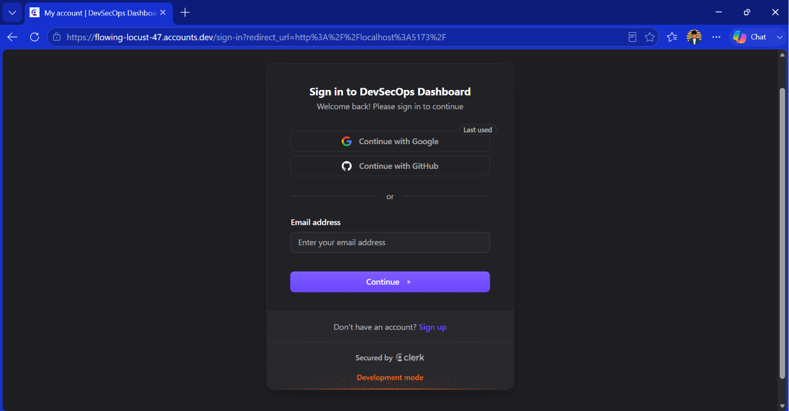
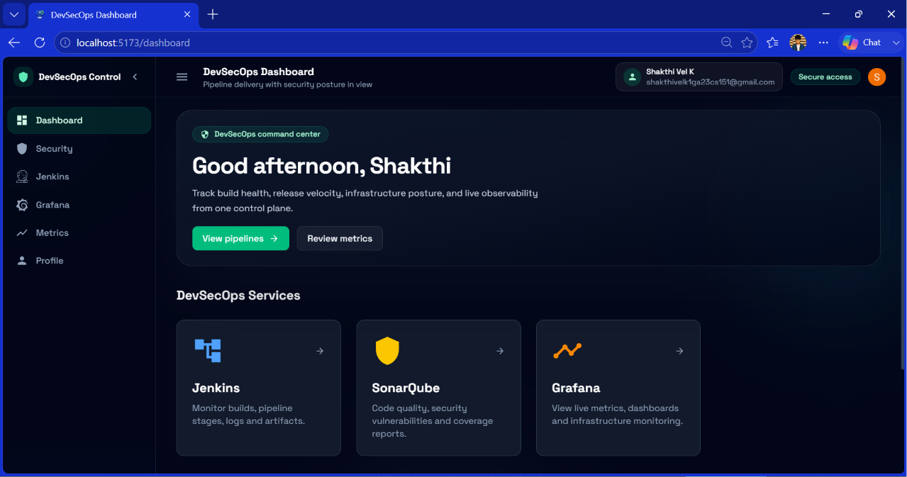
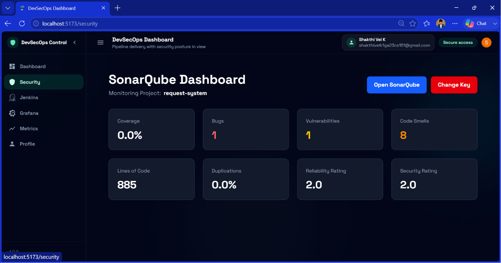
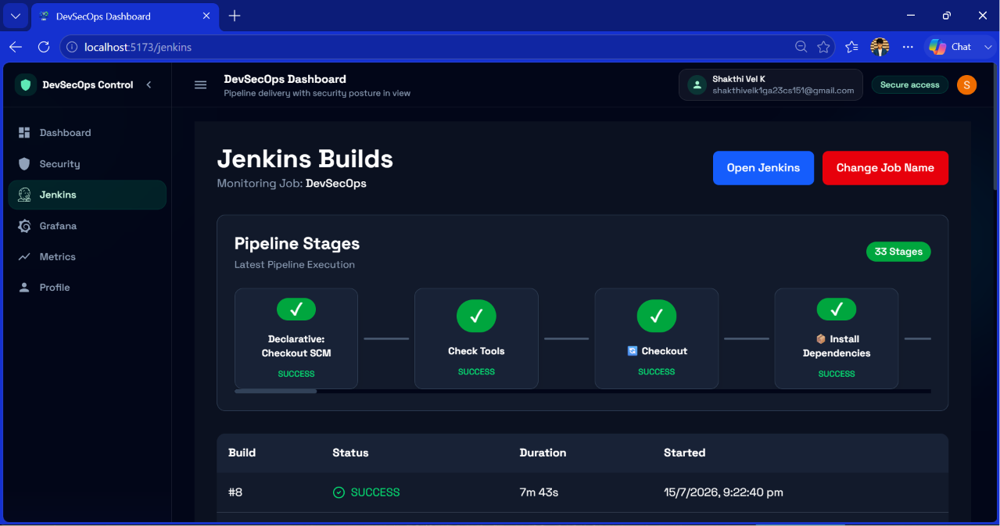
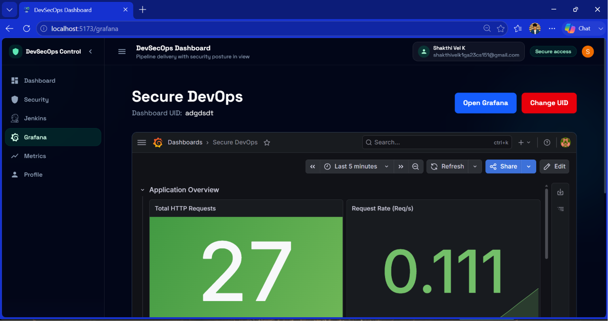
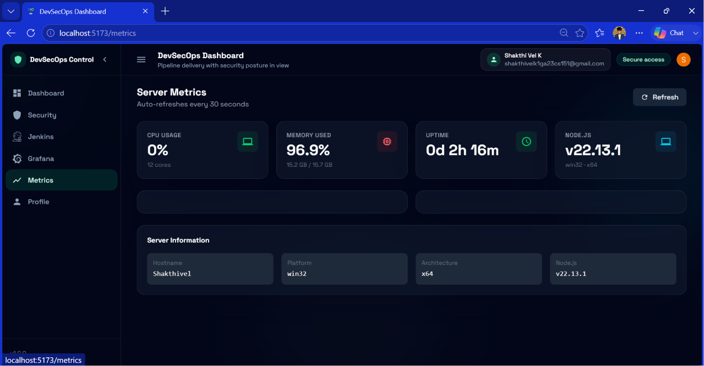
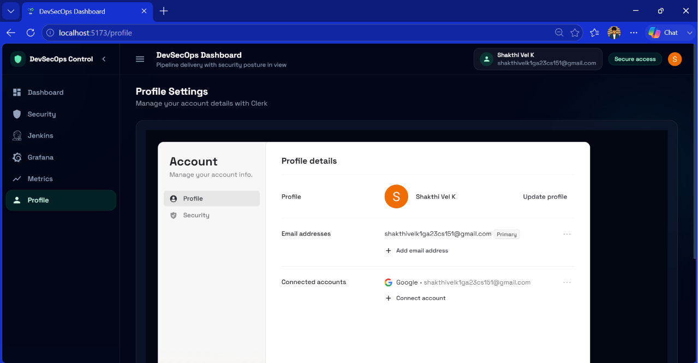

# 🚀 DevSecOps Pipeline Dashboard

A modern **Full Stack DevSecOps Dashboard** that provides centralized monitoring and management for your CI/CD pipeline. The application integrates **Jenkins**, **SonarQube**, **Grafana**, and **Server Metrics** into a single responsive dashboard with secure authentication.

---

## ✨ Features

- 🔐 Secure Authentication using Clerk
- 📊 Modern DevSecOps Dashboard
- ⚙️ Jenkins Pipeline Monitoring
- 🛡️ SonarQube Code Quality Dashboard
- 📈 Embedded Grafana Dashboard
- 💻 Live Server Metrics
- 👤 User Profile Management
- 🌙 Modern Dark UI
- 📱 Fully Responsive Design

---

# 📸 Screenshots

## 🔑 Authentication



---

## 🏠 Dashboard



---

## 🛡️ SonarQube Dashboard



---

## ⚙️ Jenkins Dashboard



---

## 📈 Grafana Dashboard



---

## 💻 Metrics Dashboard



---

## 👤 Profile



---


# 🚀 Tech Stack

### Frontend

- React.js
- Tailwind CSS
- React Router
- Axios
- React Icons
- Recharts
- Clerk Authentication

### Backend

- Node.js
- Express.js
- REST APIs

### DevOps Tools

- Jenkins
- SonarQube
- Grafana
<!-- - Docker
- Kubernetes -->
- Prometheus

---

# 📂 Project Structure

```
DevSecOps-Pipeline-Dashboard
│
├── client/
│   ├── src/
│   ├── public/
│   └── package.json
│
├── server/
│   ├── controllers/
│   ├── routes/
│   ├── services/
│   └── package.json
│
└── README.md
```

---

# ⚡ Installation

## Clone Repository

```bash
git clone https://github.com/Shakthivelk24/DevSecOps_Dashboard.git

cd DevSecOps_Dashboard
```

---

## Install Dependencies

### Frontend

```bash
cd client
npm install
```

### Backend

```bash
cd server
npm install
```

---

## Environment Variables

### Client

Create

```
client/.env
```

```env
VITE_API_URL=http://localhost:5000/api
VITE_CLERK_PUBLISHABLE_KEY=YOUR_CLERK_KEY
```

---

### Server

Create

```
server/.env
```

```env
PORT=5000

# Jenkins
JENKINS_URL=http://localhost:8080
JENKINS_USERNAME=your_username
JENKINS_API_TOKEN=your_api_token

# SonarQube
SONAR_URL=http://localhost:9000
SONAR_TOKEN=your_sonar_token

# Grafana
GRAFANA_URL=http://localhost/grafana
GRAFANA_API_KEY=your_grafana_api_key
```

---

# ▶️ Run the Project

## Backend

```bash
cd server
npm run dev
```

---

## Frontend

```bash
cd client
npm run dev
```

Open

```
http://localhost:5173
```

---

# 📊 Dashboard Modules

## 🏠 Dashboard

- DevSecOps Overview
- Service Navigation
- Quick Access Cards
- User Greeting

---

## ⚙️ Jenkins

- Pipeline Stages
- Build History
- Console Logs
- Build Details
- Artifacts
- Open Jenkins
- Change Job Name

---

## 🛡️ SonarQube

- Coverage
- Bugs
- Vulnerabilities
- Code Smells
- Reliability Rating
- Security Rating
- Lines of Code
- Duplications
- Open SonarQube
- Change Project Key

---

## 📈 Grafana

- Embedded Dashboard
- Live Monitoring
- Infrastructure Metrics
- Open Grafana
- Change Dashboard UID

---

## 💻 Metrics

- CPU Usage
- Memory Usage
- Uptime
- Node.js Version
- Server Information
- Auto Refresh

---

## 👤 Profile

- Clerk Authentication
- Profile Settings
- Connected Accounts
- Email Management

---

# 📌 API Endpoints

## Jenkins

```
GET /api/v1/jenkins/:jobName/builds
GET /api/v1/jenkins/:jobName/stages
GET /api/v1/jenkins/:jobName/console
GET /api/v1/jenkins/:jobName/details
GET /api/v1/jenkins/:jobName/artifacts
```

---

## SonarQube

```
GET /api/v1/sonarqube/dashboard/:projectKey
```

---

## Grafana

```
GET /api/v1/grafana/dashboard/:uid
```

---

## Metrics

```
GET /api/v1/metrics
GET /api/v1/dashboard
```

---

# 🌟 Future Enhancements

- Kubernetes Dashboard
- Docker Container Monitoring
- Prometheus Alerts
- Trivy Security Scan
- OWASP ZAP Reports
- Role Based Access Control
- Email Notifications
- Pipeline Trigger from Dashboard

---

# 🤝 Contributing

1. Fork the repository
2. Create a feature branch

```bash
git checkout -b feature/new-feature
```

3. Commit your changes

```bash
git commit -m "feat: add new feature"
```

4. Push

```bash
git push origin feature/new-feature
```

5. Create a Pull Request

---

# 👨‍💻 Author

**Shakthi Vel K**

- GitHub: https://github.com/Shakthivelk24
- LinkedIn: www.linkedin.com/in/shakthi-vel-k-b35484343

---

# ⭐ Support

If you like this project, don't forget to ⭐ the repository.